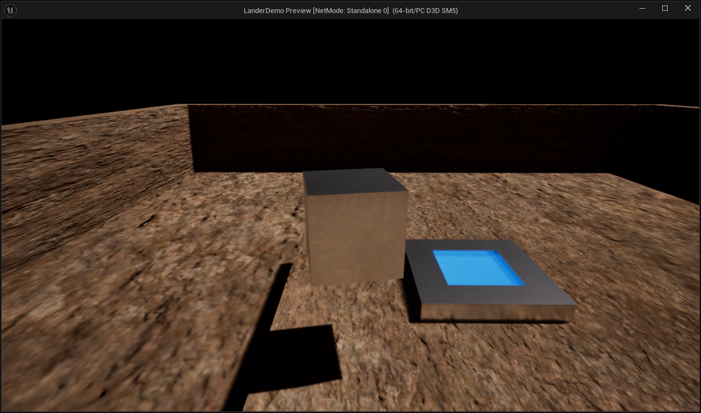

# LanderDemo

Use Spacebar to blast off! Tweak your flight trajectory with W, A, S, D to touch down on the pad. Gently, now, gently! Press R to restart if you get stuck.

For Unreal 5.4.2

Notes:
* Adapted from the Unreal ThirdPersonCharacter template. Uses Blueprints only.
* OpenLevel is stuttering. My GPU apparently doesn't have enough memory to cache multiple levels... the project has been switched to Direct X11 to hopefully relieve it a bit (but not much...). Pretty sure it's the high-res textures. Otherwise I would have made more levels.
* Controls are like that of a baby deer learning to walk, much like the experience of learning a new engine.
* Could use a starting & end screen.
* Could use a deep space or starry skybox.
